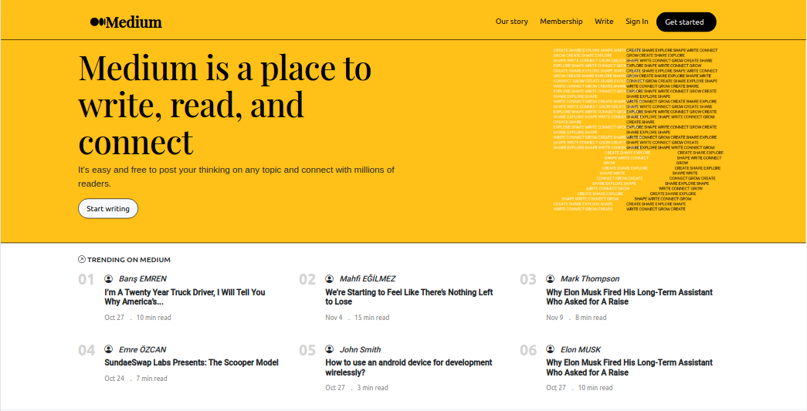
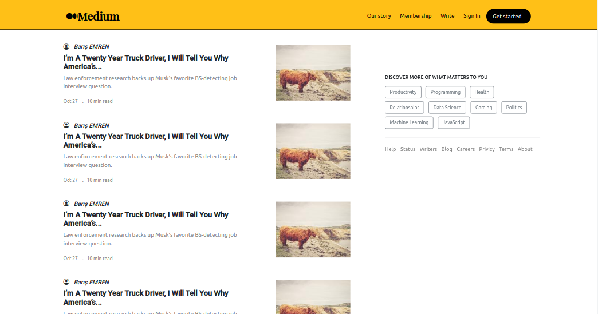

## Medium.com Clone with HTML-CSS (BOOTSTRAP)  

Bootstrap's starting folders not uploaded to repo.
You can download from [getbootstrap](https://getbootstrap.com/) or include the url's to your HTML.

